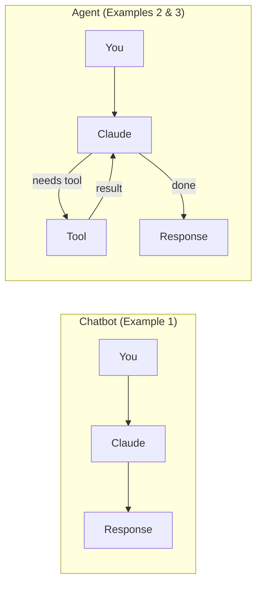

# Introduction to AI Agents

A beginner-friendly workshop that teaches you what AI agents are, how they differ from regular chatbots, and how to build your own using Python and the Claude API.

**Created by Khrishawn Powell** | [@KPAI3006](https://github.com/KPAI3006)

---

## What is an AI Agent?

Think of it like this:

- A **chatbot** is like texting a friend who knows a lot about restaurants. They can recommend places, describe menus, and give opinions -- but they can't actually *do* anything for you.
- An **AI agent** is like a personal assistant. They can look up restaurant reviews, check if there are tables available, make a reservation, and send you a confirmation -- all from a single request.

**The simple definition:** An AI agent is an AI system that can:

1. **Understand** what you want
2. **Decide** what actions to take
3. **Use tools** to perform those actions
4. **Evaluate** the results
5. **Keep going** until the task is done

The key word is **tools**. Agents have access to tools (functions, APIs, databases) that let them interact with the real world -- not just generate text.

---

## What Do AI Agents Do?

Here are some real-world examples:

- **Customer Support Agent** -- Looks up your order, checks shipping status, and processes a refund, without transferring you to a human
- **Research Agent** -- Searches the web for articles on a topic, reads them, and writes a summary report
- **Coding Agent** -- Reads your code, identifies bugs, writes fixes, and runs tests to verify
- **Personal Assistant Agent** -- Reads your emails, drafts replies, and schedules meetings on your calendar

---

## Benefits of AI Agents

- Complete **multi-step tasks** autonomously (not just one question at a time)
- Use **real tools and data**, not just knowledge from training
- **Adapt their plan** based on what they discover along the way
- Save you time on **repetitive, multi-step workflows**

---

## Chatbot vs. Agent -- The Key Difference

| Feature | Chatbot (Example 1) | Agent (Examples 2 & 3) |
|---|---|---|
| Can answer questions | Yes | Yes |
| Can use tools | No | Yes |
| Can take actions | No | Yes |
| Has a loop | No (single reply) | Yes (keeps going until done) |
| Knows when to stop | Always stops after reply | Decides when task is complete |

> **A chatbot gives you an answer. An agent gets you a result.**



---

## Prerequisites

Before starting, make sure you have:

- **Python 3.10+** installed on your computer
  - Check: Open your terminal and run `python3 --version`
  - [Download Python](https://www.python.org/downloads/) if you don't have it
- **An Anthropic API Key** (free credits available for new accounts)
  - Sign up at [console.anthropic.com](https://console.anthropic.com/)
  - Go to **API Keys** and create a new key
- **A text editor** ([VS Code](https://code.visualstudio.com/) recommended)
- **Basic terminal/command line familiarity** (we'll guide you through every command)

---

## Setup

### Step 1: Clone this repository

```bash
git clone https://github.com/KPAI3006/intro-to-ai-agents.git
cd intro-to-ai-agents
```

### Step 2: Create a virtual environment

```bash
python3 -m venv .venv
source .venv/bin/activate    # Mac/Linux
# .venv\Scripts\activate     # Windows
```

### Step 3: Install dependencies

```bash
pip install -r requirements.txt
```

### Step 4: Set up your API key

```bash
cp .env.example .env
```

Now open `.env` in your text editor and replace `your-api-key-here` with your actual Anthropic API key.

### Step 5: Run your first example!

```bash
python examples/01_simple_chatbot.py
```

---

## Troubleshooting

| Error | Fix |
|-------|-----|
| `ModuleNotFoundError` | Make sure your virtual environment is activated (`source .venv/bin/activate`) |
| `AuthenticationError` | Double-check your API key in the `.env` file |
| `RateLimitError` | You may have exceeded free tier limits -- wait a moment and try again |
| `Connection error` on weather | Check your internet connection (Example 2 calls a live weather API) |

---

## The Examples

This workshop has three examples that build on each other:

| Example | File | What You'll Learn |
|---------|------|-------------------|
| 1 | `01_simple_chatbot.py` | How to talk to Claude with Python (NOT an agent) |
| 2 | `02_tool_using_agent.py` | How to give Claude tools and watch it decide when to use them |
| 3 | `03_research_agent.py` | How to build a full agent loop that keeps working until done |

---

## Example 1: Simple Chatbot

**Run it:** `python examples/01_simple_chatbot.py`

This is a regular chatbot -- it has no tools and no loop. It can answer questions using Claude's knowledge, but it cannot take any actions.

**How it works:**

```
You: "What is machine learning?"
  │
  ▼
Claude API (single call)
  │
  ▼
Claude: "Machine learning is..."
  │
  DONE (no loop, no tools)
```

**What to notice:**
- You type a message, Claude responds -- that's it
- Claude remembers the conversation (try asking a follow-up question!)
- This is the **baseline** -- compare this to the next examples

---

## Example 2: Tool-Using Agent

**Run it:** `python examples/02_tool_using_agent.py`

Now Claude has access to **tools** -- a real weather API and a calculator. When you ask a question that needs a tool, Claude *decides on its own* to use it.

This example runs 3 demo questions automatically so you can see the different behaviors:
1. Weather question -> Claude uses the **weather tool** (live data!)
2. Math question -> Claude uses the **calculator tool**
3. Knowledge question -> Claude answers **directly** (no tool needed)

**How it works:**

```
You: "What's the weather in London?"
  │
  ▼
Claude API (call 1) ─── stop_reason: "tool_use"
  │
  ▼
Our code runs get_weather("London") ─── calls wttr.in API
  │
  ▼
Claude API (call 2) ─── with tool result, stop_reason: "end_turn"
  │
  ▼
Claude: "The weather in London is 15°C and cloudy."
  │
  DONE
```

**What to notice:**
- The yellow `[Agent]` lines show when Claude is using a tool
- Claude uses tools for weather and math, but answers the knowledge question directly
- The key concept: `stop_reason == "tool_use"` means "Claude wants to use a tool"

---

## Example 3: Research Agent (Full Agent Loop)

**Run it:** `python examples/03_research_agent.py`

This is a **full agent** with an autonomous loop. Claude searches the web, reads pages, and saves a report -- all on its own. It decides how many tools to use and when to stop.

**How it works:**

```
You: "Research AI agents and save a report"
  │
  ▼
┌─► Claude API call ──► tool_use: search_web("AI agents")
│     │
│     ▼
│   Tool returns real search results from DuckDuckGo
│     │
├─► Claude API call ──► tool_use: get_page_content(url)
│     │
│     ▼
│   Tool fetches and returns the page text
│     │
├─► Claude API call ──► tool_use: search_web("AI agent applications")
│     │
│     ▼
│   Tool returns more search results
│     │
├─► Claude API call ──► tool_use: save_report("report.md", content)
│     │
│     ▼
│   Tool saves the report to outputs/ folder
│     │
└─► Claude API call ──► stop_reason: "end_turn"
      │
      ▼
    Claude: "I've completed my research and saved the report."
      │
    DONE
```

**What to notice:**
- The numbered `[Step 1]`, `[Step 2]` etc. show each tool call in sequence
- Claude makes **multiple** searches to get comprehensive information
- The `while` loop keeps running until `stop_reason == "end_turn"`
- A real report file appears in the `outputs/` folder when done!

---

## The Agent Loop -- Tying It All Together

Here's the progression across the three examples:

| | Example 1 | Example 2 | Example 3 |
|---|---|---|---|
| **Pattern** | Request -> Response | Request -> Tool -> Response | Request -> [Tool -> ...]* -> Response |
| **Loop?** | No | No (single cycle) | **Yes (while loop)** |
| **Tool calls** | 0 | 0-1 per question | Multiple (Claude decides) |
| **Claude decides?** | No | Yes (whether to use a tool) | Yes (which tools, how many, when to stop) |

Notice how each example gives Claude more autonomy:
- **Example 1:** Claude just responds
- **Example 2:** Claude can choose to use a tool
- **Example 3:** Claude runs an entire multi-step process on its own

**That progression from chatbot to agent is the entire concept.**

---

## Next Steps

Now that you understand how AI agents work, here are ways to keep learning:

- **Modify the examples** -- Add new tools to Example 2 (a unit converter? a dictionary lookup?)
- **Build your own agent** -- Think of a task you do repeatedly and build an agent for it
- **Explore the docs** -- [Anthropic API Documentation](https://docs.anthropic.com)
- **Study real examples** -- [Anthropic Cookbook](https://github.com/anthropics/anthropic-cookbook)
- **Take a course** -- [Anthropic Courses](https://github.com/anthropics/courses)
- **Read the research** -- [Building Effective Agents (Anthropic)](https://www.anthropic.com/research/building-effective-agents)

---

## License

This project is open source and available for educational use. Feel free to fork, modify, and share!
